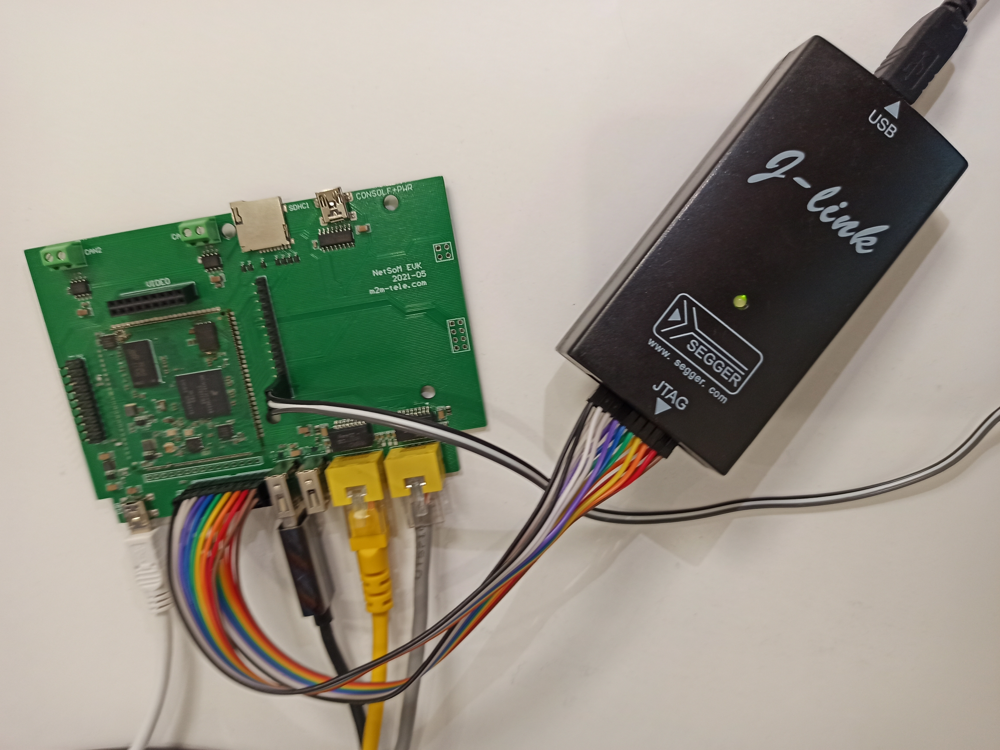

## GUI IDE for OpenWrt Development

This project makes two things:

1. Simplifies setup of [imx6ull-openwrt](https://github.com/wireless-road/imx6ull-openwrt) repository on local machine by avoiding inconsistency and incompatibility of different packages required to be installed to compile OpenWrt image for [imx6ull NetSoM](https://m2m-tele.com/product/netsom/)
2. Setups Eclipse as graphical IDE that lets to:
   1. navigate through source code using GUI instead command line utilities like [grep](https://man7.org/linux/man-pages/man1/grep.1.html) and [find](https://man7.org/linux/man-pages/man1/find.1.html).
   2. debug u-boot, kernel (not implemented yet) using external J-Link USB debugger connected to the [NetSoM Development Board](https://m2m-tele.com/product/imx6-development-board/) using JTAG interface:
   3. debug user layer application using onboard gdb server.



## Getting started

Clone the repository:
```
git clone https://github.com/wireless-road/imx6ull-openwrt
```

Open `docker-compose.yml` and replace left side of `- /home/al/docker/ide/:/opt/eclipse/` volume declaration to the path you want openwrt sources and eclipse to be placed.
Then build a container:
```
$ docker-compose run --name openwrt openwrt
```
as a result you should get access to container's console. Next you have to setup Eclipse and openwrt sources by running:
```
$ ./setup_ide.sh
```
It makes few things:
1. clones OpenWrt sources from [imx6ull-openwrt](https://github.com/wireless-road/imx6ull-openwrt)
2. build simpliest device configuration image to get toolchain compiled.
3. installs eclipse.

As it finishes you should find `eclipse` and `imx6ull-openwrt` folders by `/opt/eclipse` path.
As eclipse has very limited possibilities for creation and configuration projects from command line but luckely it is portable we did a trick:
installed Eclipse on host machine at same path (`/opt/eclipse/eclipse`), created project from existing makefile project for `u-boot` sources (`kernel` project to be added soon, I hope), packet resulted folder to archive and here is preconfigured Eclipse installer. So don't move `eclipse` and `imx6ull-openwrt` folders to different pathes as it will brake Eclipse`s projects.

So after you finished setup (just once) you can start to work with source code using command line or eclipse GUI.

### command line mode

just move to source code folder:

```
$ cd /opt/eclipse/imx6ull-openwrt
```

and here as usual like on the host machine:
```
$ ./compile.sh list
$ ./compile.sh <any available configuration>
```

the only pros of using docker image in that case is fastest way to getting started: no need to deal with possible troubles that might happens on requirements installation or sources compilation.


### gui mode

launch eclipse:
```
$ /opt/eclipse/eclipse/eclipse
```


right click on project and press to `Clean Project`.
right click on project and press to `Build Project`:


### Debugging U-boot
The unexpected thing you must keep in mind when you start debug U-boot is that it [relocates](https://source.denx.de/u-boot/u-boot/blob/HEAD/doc/README.arm-relocation) itself from one RAM memory address to another (to the end of RAM).
The only dirty thing need to be done is hard code one line in source code. For that:
In the link above step by ste guide provided to workaround. 

#### Command line debugging
So in command line mode debugging you have to:
1. Start GDB server:
```
$ JLinkGDBServer -device MCIMX6Y2 -if JTAG -speed 1000
```
2. Start GDB session:
```
$ gdb-multiarch u-boot --nx
```
3. Connect to target device and load `u-boot` image:
```
(gdb) target remote localhost:2331
(gdb) monitor reset
(gdb) monitor halt
(gdb) monitor sleep 200
(gdb) load
(gdb) display /x $pc
```
4. Place device tree blob `u-boot.dtb` right after `u-boot` image. That address can be determined as `__end` address in `u-boot.map` file:
```
$ cat u-boot.map | grep __end
 *(.__end)
 .__end         0x0000000087882d68        0x0 arch/arm/lib/built-in.o
```
so 
```
restore u-boot.dtb binary 0x87882d68
```
5. Relocation workaround:
```
(gdb) b relocate_code
(gdb) c
(gdb) add-symbol-file u-boot 0x8FF2B000
(gdb) fin
(gdb) b board_init_r
(gdb) c
```
Here we set breakpoint at `relocate_code` function to make sure that `board_init_f` completed and we can place `u-boot` image at relocation address as it is explained [here](https://source.denx.de/u-boot/u-boot/blob/HEAD/doc/README.arm-relocation). Two ways to get this address described at the end of this document. Right after that we can continue to debug at relocated memory area. Detailed explanation might be found [here](https://m2m-tele.com/?p=1026&preview=true).

#### GUI debugging

To start debugging press `Run --> Debug Configurations`, select `u-boot Default` configuration.
Pay attention for following settings:

Then press `Debug`:

Eclipse suggests to swith to Debug perspective - accept it. Wait few seconds before image to be uploaded to hardware:

Don't mind about `no debug information available` message, just press to `Resume (F8)` button:

and navigate through the code. If you left breakpoint unchanged it should stop you at `relocate_code` function. So to pass relocation successfully you should manually place `u-boot` image at relocation address. For that open `Debugger Console` and type commands explained before:

Than you can continue to debug code even after relocation.


#### container restarting

on exit from container console it stops:
```
$ exit
```

to enter it back:
```
$ docker start openwrt
$ docker exec -it openwrt bash
```

#### user layer applications development
here two developers guide to develop and debug user layer applications:
- [debugging u-boot. Detailed guide](https://m2m-tele.com/blog/2021/09/19/how-to-debug-u-boot/)
- [openwrt development and debugging using eclipse ide](https://m2m-tele.com/blog/2021/09/07/embedded-linux-development-and-remote-debugging-using-eclipse-ide/)
- [openwrt development and debugging using eclipse ide. part 2.](https://m2m-tele.com/blog/2021/09/07/embedded-linux-development-and-remote-debugging-using-eclipse-ide-part-2/)

